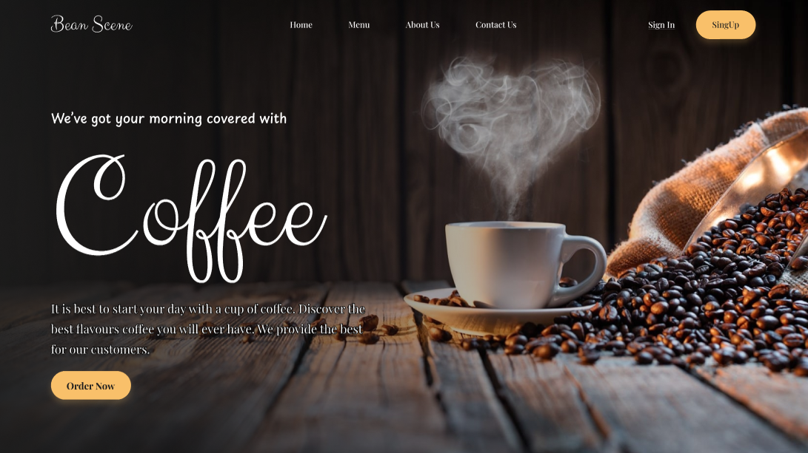
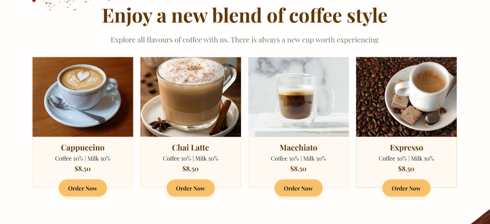
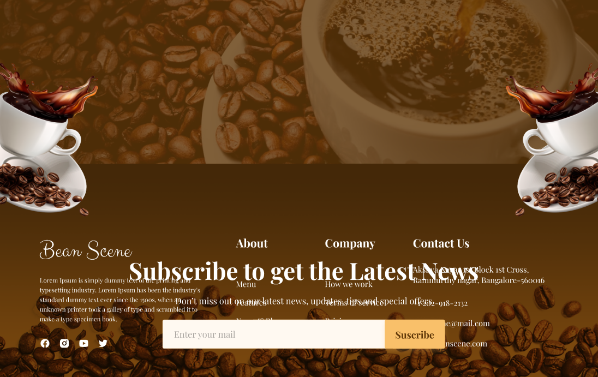

# ☕ Coffee Shop

Un site web **Coffee Shop** moderne et réactif, construit avec **React.js** et **Tailwind CSS v3**. Ce projet propose une interface utilisateur fluide avec un design élégant et une navigation intuitive.

## 🚀 Technologies Utilisées

- **React.js** ⚛️
- **Tailwind CSS 3** 🎨
- **Heroicons** 🖌️
- **JavaScript (ES6+)**

## 📸 Aperçu

### 🏠 Home Page



### 📖 About Page


### 📜 Menu Page



### 📩 Contact Page



## ✨ Fonctionnalités

✅ **Design responsive** adapté à tous les écrans 📱💻
✅ **Effets de transition fluides** et animations 🔄
✅ **Menu interactif** et boutons de commande 🛒
✅ **Images de café haute qualité** ☕

## 📂 Installation

1️⃣ **Cloner le dépôt** :

```bash
git clone https://github.com/Bilel-lefi/Coffee_Shop.git
cd Coffee_Shop
```

2️⃣ **Installer les dépendances** :

```bash
npm install
```

3️⃣ **Démarrer le serveur de développement** :

```bash
npm run dev
```
